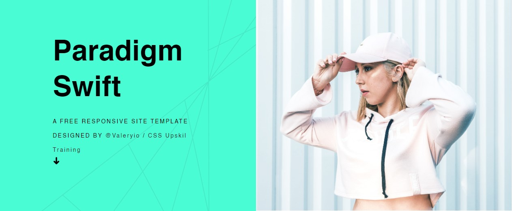

# Website Frontend integration

## Welcome! 👋

  - [The challenge](#the-challenge)
  - [Links](#links)
  - [My process](#my-process)
  - [Built with](#built-with)
  - [What I learned](#what-i-learned)
  - [Continued development](#continued-development)
  - [Useful resources](#useful-resources)

### The challenge

Integrate this website that you'll find [here](https://html5up.net/uploads/demos/paradigm-shift/), in HTML, CSS and javascript.

### Links

- Template URL: [Get the Template](https://html5up.net/uploads/demos/paradigm-shift/)

## My process
This time, I choosed to build the mobile first, with only CSS, and then add the rest!

### Built with

- CSS3 custom properties
- Flexbox
- Javascript (a little bit...)
- Full responsive method

### What I learned

Grid are useful to both vertical and horizontal disposition, but flex are more useful
for linearisation, and UI elements!

### Continued development

- Deep understanding of grid, box and layout

### Useful resources
- [MDN font Styling article](https://developer.mozilla.org/en-US/docs/Learn/CSS/Styling_text/Fundamentals)

